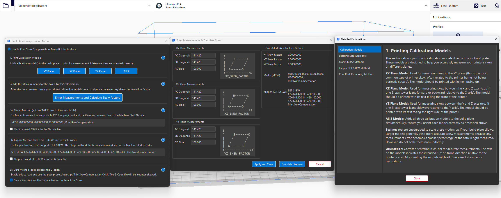

# PrintSkewCompensation Plugin

This plugin helps compensate for hardware skew in 3D printers.

## Disclaimer

This plugin is provided "as is" without any warranty, express or implied. The user assumes all responsibility and risk for the use of this plugin. The authors and contributors are not liable for any damages, whether direct, indirect, consequential, or incidental, arising from the use or inability to use this plugin. This includes, but is not limited to, damage to equipment, loss of data, or any other losses. By using this plugin, you agree to these terms.

## Features

*   Calculates skew factors for XY, XZ, and YZ planes based on user measurements.
*   Provides several methods for applying skew compensation:
    *   **A. Marlin M852:** Generates the `M852` command for Marlin firmware.
    *   **B. Klipper SET_SKEW:** Generates the `SET_SKEW` command for Klipper firmware.
    *   **C. Cura (Alter G-Code):** Modifies the G-code directly using a post-processing script.
*   Optionally adds Marlin or Klipper commands to the start G-code automatically.
*   User-friendly dialog to input measurements and view calculated results.
*   Full Help menu with detailed explanation for each step -> Click on ? on top of each section to view
*   Includes calibration models in `.stl` formats that can be added with a button to the build plate of current selected printer.
*   Stores the measurements and configurations per printer so the user can switch between printers and retain the measurements and settings of each printer.

## General Instructions

### 1. Calibration Print

1.  **Open the plugin menu:** After installation and restarting Cura In Cura, navigate to `Extensions > Print Skew Compensation > Calibrate Skew`
2.    **Add Calibration Models:** Add the calibration_model to the build plate of your printer depending on which axis you want to calibrate. See the Help menu for detailed description of steps.
4.  **Print the Models:** Print the calibration models for the planes you wish to compensate for (XY, XZ, YZ). It's recommended to print them one at a time or with sufficient spacing to ensure accurate measurements. Use your typical print settings.
5.  **Measure the Prints:** After printing, carefully measure the following distances on each model:
    *   Diagonal AC
    *   Diagonal BD
    *   Side AD (this is the side with the single notch/indicator)

    Refer to the diagrams in the plugin's measurement dialog for visual guidance on these measurements.

### 2. Entering Measurements and Calculating Skew

1.  **Access the Plugin:** In Cura, navigate to `Extensions > Print Skew Compensation > Calibrate Skew`. This will open the "Enter Measurements & Calculate Skew" dialog.
2.  **Enter Measurements and Calculate Skew Factors:**
    *   Enter the measured AC, BD, and AD values for each plane (XY, XZ, YZ) into the corresponding input fields in the dialog.
    *   The dialog displays images to help identify the correct measurements.
3.  **Calculate & Preview:** Click the "Calculate & Preview" button. The dialog will update to show:
    *   Calculated skew factors for each plane.
    *   The corresponding Marlin `M852` G-code command.
    *   The corresponding Klipper `SET_SKEW` command.
4.  **Apply and Close:** Once you are satisfied with the previewed calculations, click "Apply and Close". This saves your measurement inputs for future sessions.

### 3. Configuring Compensation Method

1.  **Enable Compensation:** Check the "Enable Skew Compensation" setting.
2.  **Choose Compensation Method:** Select your preferred method from the "Compensation Method" checkbox 3a, 3b, 3c:
    *   **None:** No compensation will be applied.
    *   **3a. Marlin M852:** If you use Marlin firmware that supports `M852` for skew compensation.
           *   You can manually add the `M852` command (displayed in the measurement dialog) to your printer's configuration or start G-code.
           *   Alternatively, enable the "Add Marlin M852 to G-code" setting in Cura to have the plugin automatically insert the command into your machine's start G-code.
    *   **3b. Klipper SET_SKEW:** If you use Klipper firmware.
           *   You can manually add the `SET_SKEW` parameters (displayed in the measurement dialog) to your Klipper `printer.cfg` file.
           *   Alternatively, enable the "Add Klipper SET_SKEW to G-code" setting in Cura to have the plugin automatically insert the `SET_SKEW` command (if your Klipper setup processes it from G-code) into your machine's start G-code. *Note: For Klipper, permanent storage in `printer.cfg` is generally preferred.*
    *   **3c. Cura (Alter G-Code):** The plugin will use a post-processing script to modify the G-code of your prints to compensate for skew. This is done automatically after slicing.
3.  **Validation - IMPORTANT:** Ensure the compensation is correctly applied depending on the method before starting a print. This includes examining the gcode generated to make sure all instructions are within the build-volume.

### 4. Slicing and Printing

*   With compensation enabled and your chosen method configured, slice your models as usual.
*   If using the "Cura (Alter G-Code)" method, the post-processing script will automatically apply the corrections.
*   If using Marlin/Klipper methods with automatic G-code insertion, the command will be added to the start of your print jobs.
      *   If you have multiple printers in Cura, each set of measurements and settings will be tied to that specific printer. So you would have to repeat the process if you have multiple printers that require correction.
      *   Ensure that only one method (Firmware / Software post processing / Software start gcode) of compensation is active on your machine, otherwise you will end up overcompensating and your print will be skewed in the opposit direction.

## Important Notes

*   The accuracy of the compensation depends heavily on the accuracy of your printed calibration models and your measurements.
*   Make sure to read through the Help menu following the instructions.
*   It's good practice to re-calibrate if you make significant changes to your printer's hardware.
*   The "Modify Model" compensation method mentioned in older descriptions is not the primary focus of the current G-code and firmware command-based approaches.

## Acknowledgment

This plugin was created from the idea, post processing script, and using the models that @GregValiant provided. 
This is in addition to his efforts in testing and print validation.